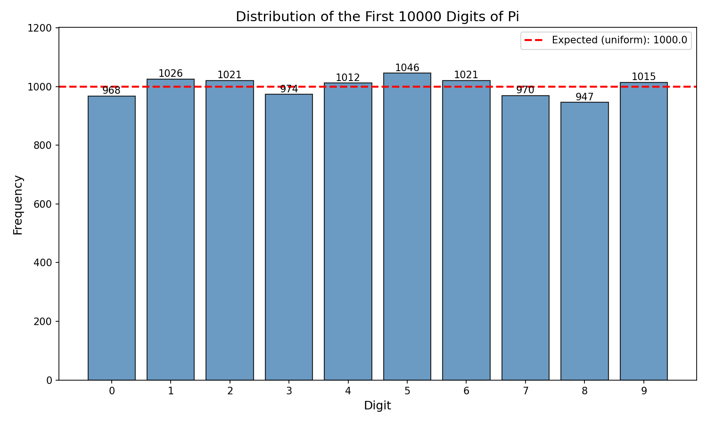

# Plot Digits of Pi

Visualize the distribution of digits in pi to verify its randomness properties.



## Features

- Compute any number of digits of pi using arbitrary-precision arithmetic
- Generate bar charts showing digit frequency distribution
- Compare actual distribution against expected uniform distribution

## Installation

```bash
pip install -r requirements.txt
```

## Usage

```bash
python plot_digits_of_pi.py
```

To change the number of digits analyzed, modify `NUM_DIGITS` in the script:

```python
NUM_DIGITS = 10000  # Analyze first 10,000 digits
```

## Example Output

```
Computing 10000 digits of pi...

Distribution of first 10000 digits of pi:
-----------------------------------
  0:  968 ( 9.68%)
  1: 1026 (10.26%)
  2: 1021 (10.21%)
  3:  974 ( 9.74%)
  4: 1012 (10.12%)
  5: 1046 (10.46%)
  6: 1021 (10.21%)
  7:  970 ( 9.70%)
  8:  947 ( 9.47%)
  9: 1015 (10.15%)
-----------------------------------
  Expected per digit: 1000.0 (10.00%)
```

## Dependencies

- `matplotlib` - Plotting
- `mpmath` - Arbitrary-precision arithmetic
